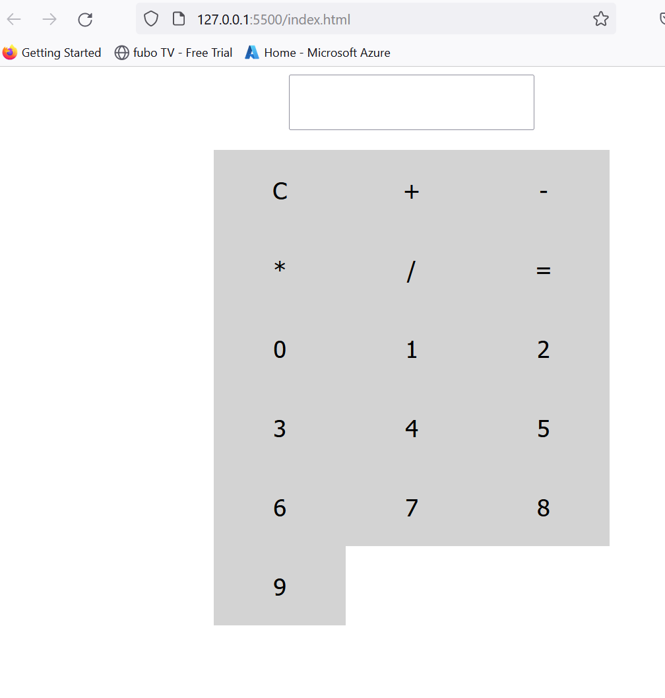

# Calculator Web Application

The calculator web application that performs basic arithmetic operations. This application is built using HTML, CSS, and JavaScript.

## Prerequisites
+ Text editor is Visual Studio Code.

## Built With
+ HTML: Used to create the structure and content of the web page.
+ CSS: Used to style the web page.
+ JavaScript: Used to add interactivity and perform arithmetic operations.

